<div align="center">
  
  <h1>
    
  </h1>
  <p><em>🌟 아이만을 위한 특별한 동화를 만들어주는 AI 앱</em></p>
</div>

## 👀 About Project
#### :raising_hand: AI 기반 개인화 동화생성 모바일 애플리케이션 "엄빠, 읽어도!"<br/>
#### :fire: 아이만을 위한 맞춤형 동화와 색칠공부를 제공하는 풀스택 프로젝트<br/>
#### :mortar_board: 1조 팀 협업 프로젝트 - Flutter + Spring Boot + Python FastAPI

---

## 🚀 시연 영상 및 주요 결과

### 🎬 [전체 기능 시연 영상 보러가기](https://drive.google.com/file/d/1XXKdtG4rx2Q8TNCUGCAxraOUFC_E01TU/preview) 
> 📱 실제 앱 사용 모습을 영상으로 확인해보세요!

### 📊 [프로젝트 발표 자료 보러가기](https://drive.google.com/file/d/1RoQF4mNE1gvWeFgRVHXDASi0m9Vq_XL0/view?usp=sharing)
> 📋 프로젝트 기획서 및 발표 자료를 확인해보세요!

---

## 📱 앱 스크린샷
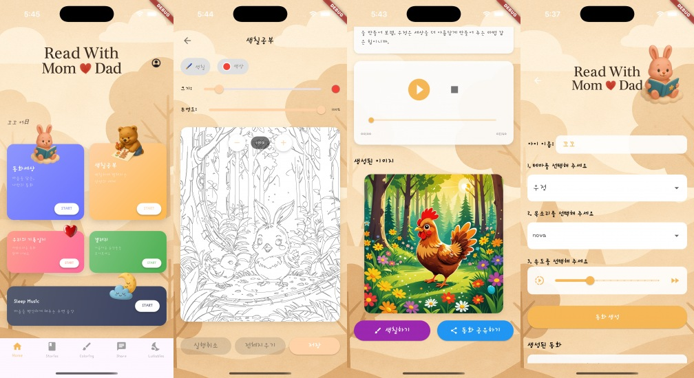
<details>
<summary>

#### 📋 앱 스크린샷 디테일 보기

</summary>
<br>
<details>
<summary>🏠 홈 화면</summary>
<br>  
> 온보딩 및 홈 화면
  <br>
<p align="center">
  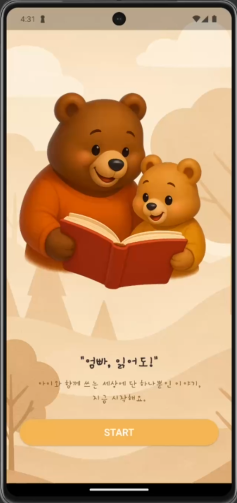
  
</p>
</details>
<details>
<summary>👤 프로필 설정 화면</summary>
<br>
> 프로필 관리
  <br>
<p align="center">
  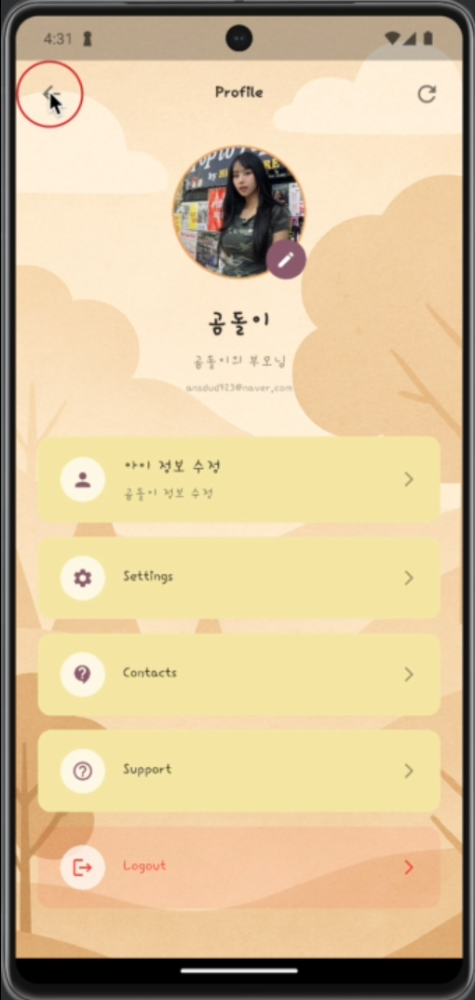
</p>
</details>
<details>
<summary>📚 동화생성 화면</summary>
<br>
> 동화 생성 및 목록
<br>
<p align="center">
  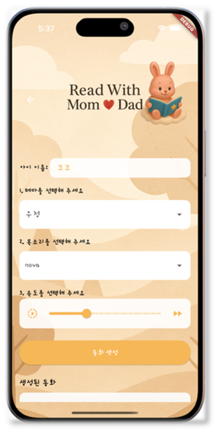
  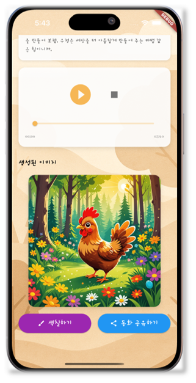
</p>
</details>
<details>
<summary>🎨 색칠공부 화면</summary>
<br>
> 디지털 색칠공부
  <br>
<p align="center">
  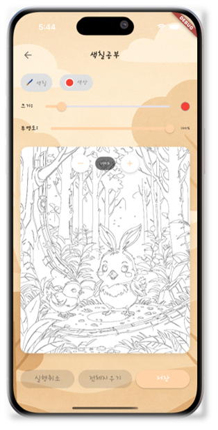
</p>
</details>
<details>
<summary>🎵 자장가 화면</summary>
<br>
> 자장가 음악 및 영상
  <br>
<p align="center">
  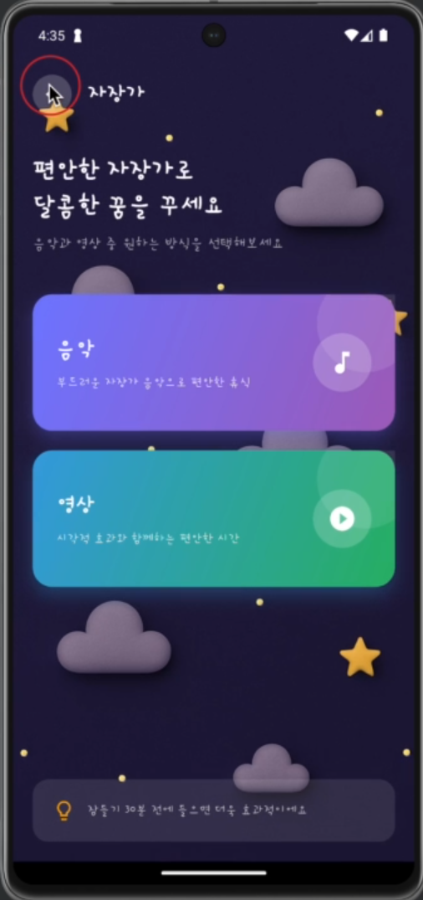
  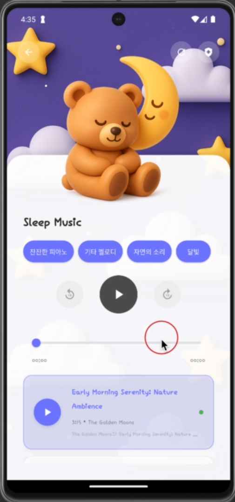
  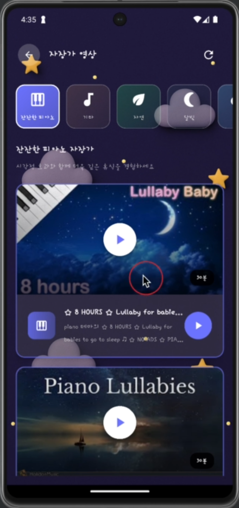
  
</p>
</details>
<details>
<summary>📖 우리들의 기록일지 화면</summary>
<br>
> 커뮤니티 공유
  <br>
<p align="center">
  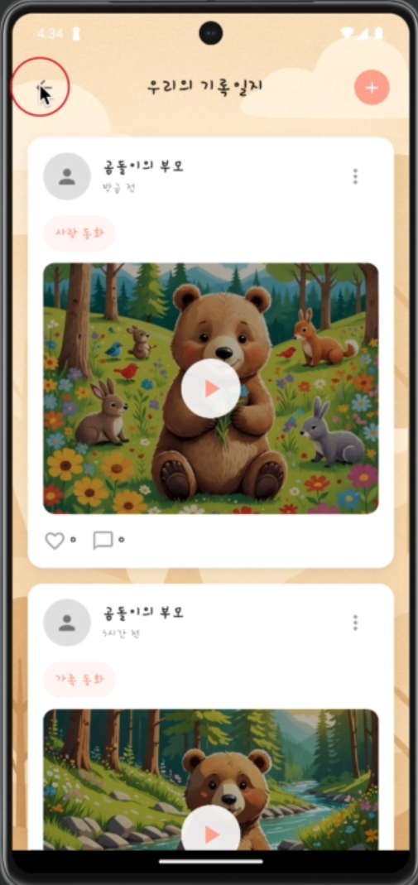
</p>
</details>
<details>
<summary>📱 태블릿 지원 화면</summary>
<br>
> 반응형 UI (iPad Pro)
  <br>
<p align="center">
  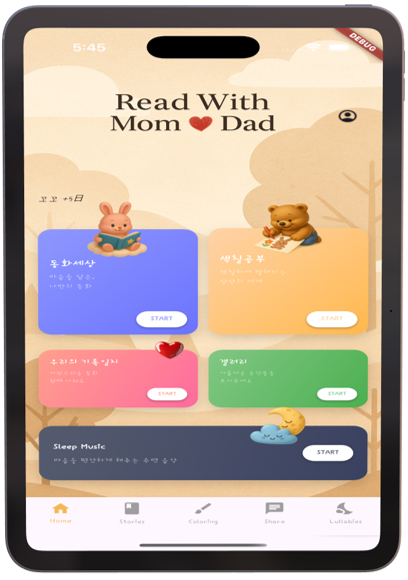
</p>
</details>
</details>


## 🧱 Tech Stack

### Frontend


### Backend


### Database & Storage


### AI & APIs


### Tools


---

## ✨ 주요 특징 (Key Features)
🎨 **AI 동화 생성**: OpenAI GPT를 활용한 개인화된 동화 창작  
🖼️ **AI 이미지 생성**: Stability AI로 동화 일러스트 자동 생성  
🎵 **TTS 음성 합성**: 9가지 목소리로 동화 읽어주기  
🎨 **색칠공부**: 생성된 이미지를 흑백 변환하여 디지털 색칠  
📱 **갤러리**: 동화와 색칠 작품 저장 및 관리  
🎬 **커뮤니티 공유**: 동영상 생성 후 사용자간 공유  
🎵 **스마트 자장가**: YouTube API 기반 테마별 자장가 추천  

---

## 🗺️ 전체 아키텍처

<p align="center">
  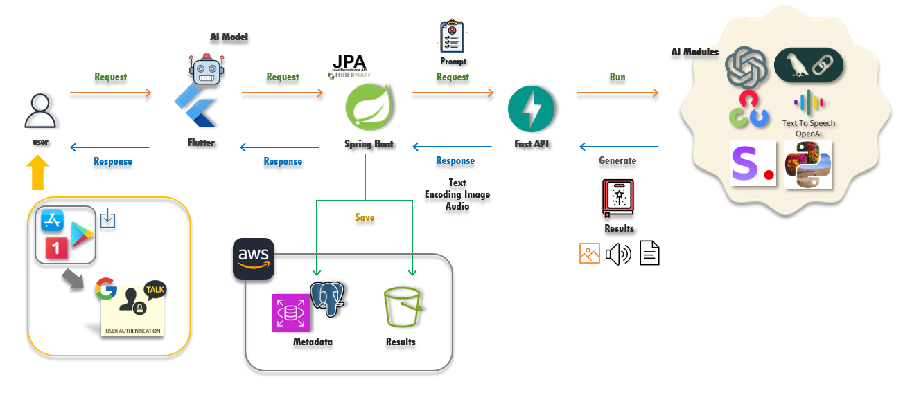
</p>

```
📱 Flutter App (Client)
    ↕️
🌐 Spring Boot Server (API Gateway & Auth)
    ↕️  
🧠 Python FastAPI Server (AI Processing)
    ↕️
☁️ AWS S3 + AWS RDS(PostgreSQL) + OpenAI API
```

---

## 📂 프로젝트 구조

<details>
<summary>📋 전체 프로젝트 구조 보기</summary>

<div style="display: flex; align-items: flex-start; gap: 20px;">
  <div style="flex: 1;">
    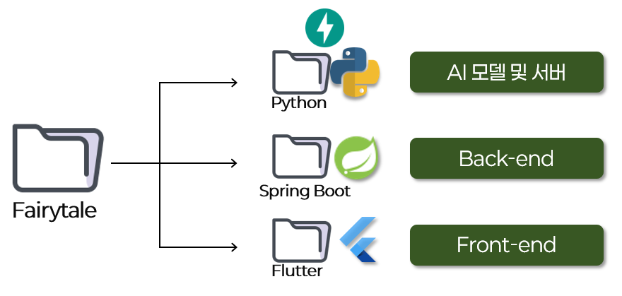
  </div>
  <div style="flex: 1;">

```
fairytale_app/
├── 📱 fairytale_flutter/          # Flutter 모바일 앱
├── 🌐 fairytale_backend/          # Spring Boot API 서버  
├── 🧠 fairytale_python/           # Python AI 서버
├── ☁️ fairytale_infrastructure/   # AWS 인프라 설정
├── 📄 docs/                      # 문서 및 기획서
└── 🗃️ database/                  # DB 스키마 및 초기 데이터
```

  </div>
</div>

</details>

<details>
<summary>📱 Flutter 앱 구조 보기</summary>

<div style="display: flex; align-items: flex-start; gap: 40px;">
  <div style="flex: 1;">
    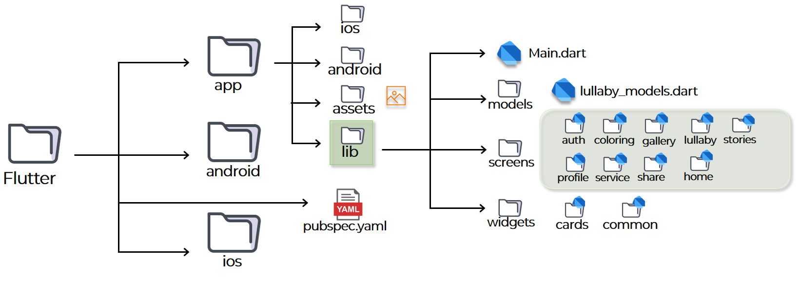
  </div>
  <div style="flex: 1;">

```
lib/
├── 📄 main.dart                   # 앱 진입점
├── 📦 models/                     # 데이터 모델
│   ├── user_model.dart
│   ├── story_model.dart
│   └── coloring_model.dart
├── 🖥️ screens/                    # 화면 구성
│   ├── 🏠 home_screen.dart         # 홈 화면
│   ├── 📚 stories_screen.dart      # 동화 메인
│   ├── 🎨 coloring/               # 색칠공부
│   │   ├── coloring_screen.dart
│   │   └── coloring_canvas.dart
│   ├── 📱 gallery/                # 갤러리
│   ├── 🎵 lullaby/                # 자장가
│   ├── 👤 profile/                # 프로필 관리
│   ├── 🌐 service/                # API 통신
│   └── 🤝 share/                  # 커뮤니티
├── 🎨 widgets/                    # 재사용 위젯
├── 🔧 utils/                      # 유틸리티
└── 🎭 theme/                      # 테마 설정
```

  </div>
</div>

</details>

<details>
<summary>⚙️ Spring Boot 백엔드 구조 보기</summary>

<div style="display: flex; align-items: flex-start; gap: 40px;">
  <div style="flex: 1;">
    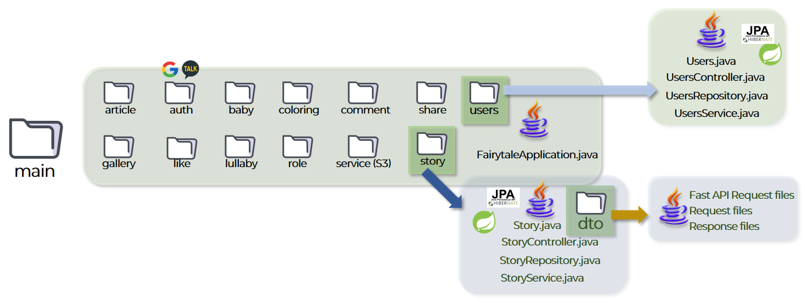
  </div>
  <div style="flex: 1;">

```
src/main/java/com/fairytale/fairytale/
├── 🔐 auth/                       # 인증/인가
│   ├── controller/
│   ├── service/
│   ├── jwt/                       # JWT 토큰 관리
│   └── oauth/                     # 소셜 로그인
├── 👶 baby/                       # 아이 정보 관리
│   ├── controller/
│   ├── service/
│   ├── repository/
│   └── entity/
├── 🎨 coloring/                   # 색칠공부 기능
├── 📱 gallery/                    # 갤러리 관리
├── 🎵 lullaby/                    # 자장가 서비스
├── 🤝 share/                      # 커뮤니티 공유
├── 📚 story/                      # 동화 생성 관리
├── 🌐 config/                     # 설정 파일들
├── 🛠️ common/                     # 공통 유틸리티
└── 📊 FairytaleApplication.java   # 메인 클래스
```

  </div>
</div>

</details>

<details>
<summary>🧠 Python AI 서버 구조 보기</summary>

<div style="display: flex; align-items: flex-start; gap: 40px;">
  <div style="flex: 1;">
    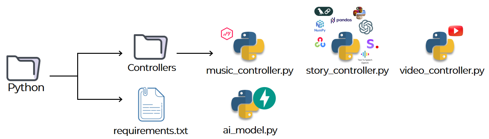
  </div>
  <div style="flex: 1;">

```
python/
├── 🚀 ai_server.py                # FastAPI 메인 서버
├── 🎮 controllers/                # API 컨트롤러
│   ├── 🎵 music_controller.py     # 자장가 추천 AI
│   ├── 📚 story_controller.py     # 동화 생성 AI
│   └── 🎬 video_controller.py     # 영상 생성 AI
├── 🧠 services/                   # AI 서비스 로직
│   ├── openai_service.py          # OpenAI GPT 연동
│   ├── stability_service.py       # Stability AI 연동
│   └── youtube_service.py         # YouTube API 연동
├── 🔧 utils/                      # 유틸리티 함수
│   ├── image_processor.py         # 이미지 처리 (OpenCV)
│   └── audio_processor.py         # 음성 처리
├── 📦 models/                     # 데이터 모델
├── ⚙️ config/                     # 설정 파일
└── 📋 requirements.txt            # Python 패키지 목록
```

  </div>
</div>

</details>

---

## 📊 ERD (Entity Relationship Diagram)

<p align="center">
  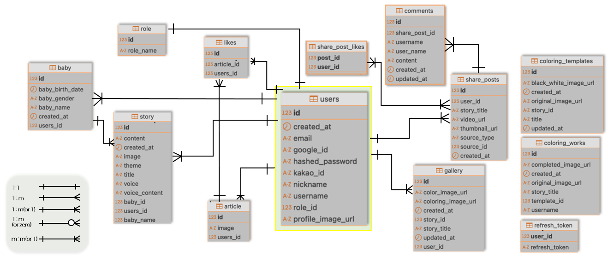
</p>

> 🗄️ PostgreSQL 기반으로 설계된 데이터베이스 구조입니다.

---

## 🛠️ 로컬 개발 환경 설정 (Getting Started)

이 프로젝트는 Docker를 사용하여 간편하게 개발 환경을 설정할 수 있습니다.

### 📋 사전 요구사항
- Git
- Docker & Docker Compose
- Flutter SDK (3.0 이상)
- Java 17 (Spring Boot용)
- Python 3.9+ (AI 서버용)
- PostgreSQL (로컬 DB용)

### 🚀 설정 단계

#### 1. **저장소 클론**
```bash
# 전체 프로젝트 클론
git clone https://github.com/ansdud923/fairytale_app.git
cd fairytale_app

# 또는 개별 저장소 클론
git clone https://github.com/ansdud923/fairytale_flutter.git
git clone https://github.com/ansdud923/fairytale_backend.git  
git clone https://github.com/ansdud923/fairytale_python.git
```

#### 2. **환경 변수 파일 생성**
```bash
# Spring Boot 백엔드
cd fairytale_backend
cp application.properties.example application.properties
# 필요한 환경 변수를 설정합니다 (DB, AWS, OpenAI API 키 등)

# Python AI 서버
cd ../fairytale_python
cp .env.example .env
# OpenAI API 키, Stability AI 키 등을 설정합니다

# Flutter 앱
cd ../fairytale_flutter
# lib/config/config.dart 파일에서 API 엔드포인트를 설정합니다
```

#### 3. **데이터베이스 설정**
```bash
# PostgreSQL 실행 (Docker 사용)
docker run --name fairytale-db \
  -e POSTGRES_DB=fairytale \
  -e POSTGRES_USER=fairytale \
  -e POSTGRES_PASSWORD=password \
  -p 5432:5432 \
  -d postgres:15
```

#### 4. **백엔드 서버 실행**
```bash
cd fairytale_backend

# 의존성 설치 및 빌드
./gradlew build

# Spring Boot 서버 실행
./gradlew bootRun
```

#### 5. **AI 서버 실행**
```bash
cd fairytale_python

# Python 가상환경 생성
python -m venv venv
source venv/bin/activate  # Windows: venv\Scripts\activate

# 의존성 설치
pip install -r requirements.txt

# FastAPI 서버 실행
uvicorn ai_server:app --host 0.0.0.0 --port 8001 --reload
```

#### 6. **Flutter 앱 실행**
```bash
cd fairytale_flutter

# Flutter 의존성 설치
flutter pub get

# 앱 실행 (시뮬레이터 또는 실제 기기)
flutter run
```

### 🌐 접속 확인
- **📱 Flutter 앱**: 에뮬레이터 또는 실제 기기에서 실행
- **🌐 Spring Boot API**: http://localhost:8080
- **🧠 Python AI API**: http://localhost:8001
- **📄 API 문서**: http://localhost:8080/swagger-ui.html

### 🔧 개발 도구 추천
- **IDE**: IntelliJ IDEA (백엔드), VS Code (Flutter, Python)
- **데이터베이스 도구**: pgAdmin, DBeaver
- **API 테스트**: Postman, Thunder Client
- **모바일 테스트**: Android Studio Emulator, iOS Simulator

### 🐳 Docker Compose 사용 (선택사항)
전체 환경을 한 번에 실행하려면:

```bash
# 루트 디렉토리에서
docker-compose up -d

# 로그 확인
docker-compose logs -f

# 서비스 중지
docker-compose down
```

---

## 💻 My Main Technologies
📱 **Frontend**: Flutter/Dart - 크로스플랫폼 모바일 앱 개발  
🌐 **Backend**: Spring Boot/Java - RESTful API 서버 및 인증 시스템  
🧠 **AI Server**: Python/FastAPI - AI 모델 통합 및 처리  
🗄️ **Database**: PostgreSQL - 관계형 데이터베이스 설계 및 관리  
☁️ **DevOps**: AWS (EC2, RDS, S3) - 클라우드 인프라 구축  

---

## 🚀 Key Technologies & Features

### 🧠 AI Integration
- **Text Generation**: OpenAI GPT-4o-mini로 개인화 동화 생성
- **Image Generation**: Stability AI (Stable Diffusion)로 동화 일러스트 생성
- **Image Processing**: OpenCV로 흑백 변환 및 색칠공부 템플릿 제작
- **Text-to-Speech**: OpenAI TTS API로 9가지 음성 지원

### 🔐 Authentication & Security
- **소셜 로그인**: 카카오, 구글 OAuth 2.0 연동
- **JWT 토큰**: Access Token (1시간) + Refresh Token (14일)
- **Strategy Pattern**: 확장 가능한 인증 시스템 설계

### ☁️ Cloud & Infrastructure
- **AWS S3**: Presigned URL을 통한 안전한 파일 스토리지
- **AWS RDS**: PostgreSQL 기반 관계형 데이터베이스
- **AWS EC2**: 백엔드 서버 호스팅

### 📱 Mobile Development
- **Flutter**: 크로스플랫폼 네이티브 성능
- **반응형 UI**: MediaQuery를 활용한 다양한 화면 크기 대응
- **CustomPainter**: 실시간 디지털 색칠 기능
- **오디오 플레이어**: 동화 음성 재생 기능

### 🎵 External APIs
- **YouTube Data API**: 테마별 자장가 추천
- **영상 생성**: 이미지와 음성을 결합한 동화 영상 제작

---

## 📋 Development Info
📅 **개발기간**: 2025년 5월 19일 ~ 6월 23일 (총 36일)  
👥 **팀구성**: 1조 <일단해조> (3명 풀스택 협업)  
📱 **버전**: v1.0.0  
🎯 **타겟**: 부모와 아이를 위한 교육 앱  

---

## 🤔 Project Stats
[](https://github.com/anuraghazra/github-readme-stats)

[](https://github.com/anuraghazra/github-readme-stats)

---

## 🤝 Team Contribution
이 프로젝트에서 **Flutter 모바일 앱 개발**, **Spring Boot 백엔드 API**, 
**데이터베이스 설계** 등 전 영역에 걸쳐 기여했습니다.

---

> 🎭 **"엄빠, 읽어도!"**는 AI 기술을 활용해
> 아이만을 위한 특별한 동화를 만들어주는 혁신적인 교육 앱입니다.
